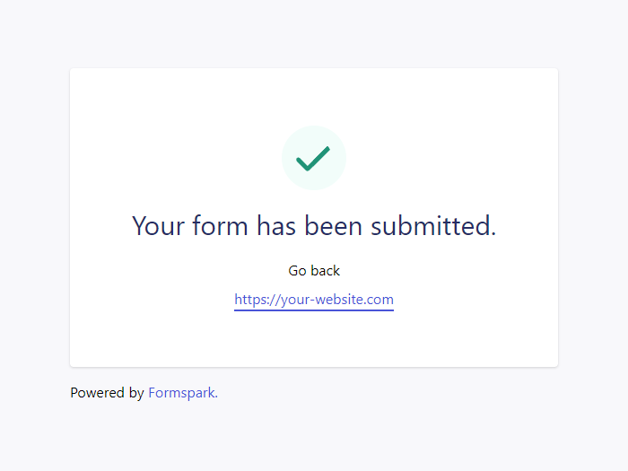
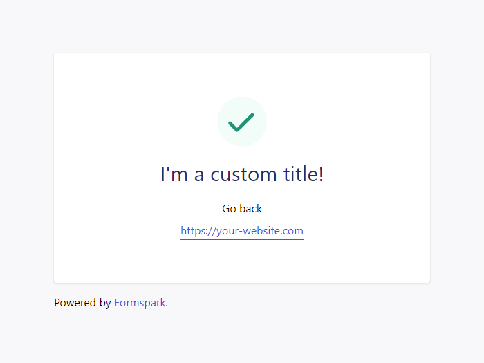

# Redirection

After submitting a form the user will be redirected to a generic feedback page hosted by Formspark.



This default behavior can be overridden in multiple ways.

## Specifying a custom redirect URL

1. Add an input of type `hidden`.
2. Set the input's name to `_redirect`.
3. Set the value to the URL you want to redirect users to.

```html
<form action="https://submit-form.com/your-form-id">
  <input
    type="hidden"
    name="_redirect"
    value="https://your-website.com/thanks"
  />
  <input type="email" name="email" />
  <button type="submit">Subscribe</button>
</form>
```

By default, Formspark appends the submission's entries to the custom redirect URL (to its search string).
This enables you to personalize your page with user-submitted data.

The above form's submissions would redirect to `https://your-website.com/thanks?email=example%40email.com`.

You can toggle off this behaviour by adding a hidden input with the name `_append` and the value `false`.

```html
<input type="hidden" name="_append" value="false" />
```

## Specifying a custom error redirect URL

Note: If you don't specify a custom error redirect URL then the configuration from `_redirect` (if present) will automatically be inherited.

1. Add an input of type `hidden`.
2. Set the input's name to `_error`.
3. Set the value to the URL you want to redirect users to.

```html
<form action="https://submit-form.com/your-form-id">
  <input type="hidden" name="_error" value="https://your-website.com/error" />
  <input type="email" name="email" />
  <button type="submit">Subscribe</button>
</form>
```

## Preventing the redirect

1. Add an input of type `hidden`.
2. Set the input's name to `_redirect`.
3. Set the value to `false`.

```html
<form action="https://submit-form.com/your-form-id">
  <input type="hidden" name="_redirect" value="false" />
  <input type="email" name="email" />
  <button type="submit">Subscribe</button>
</form>
```

## Customizing the default feedback page

You can customize the content of the default feedback page with the following reserved input names:

### `_feedback.language`

Customizes the language of the feedback page.

Default value: "en"

Supported values:

| Value | Language   |
| ----- | ---------- |
| "en"  | English    |
| "es"  | Spanish    |
| "pt"  | Portuguese |
| "fr"  | French     |
| "it"  | Italian    |
| "de"  | German     |
| "nl"  | Dutch      |

### `_feedback.success.title`

Customizes the title of the success feedback page.

Default value: Your form has been submitted.

### `_feedback.success.message`

Customizes the message of the success feedback page.

Default value: _none_

### `_feedback.error.title`

Customizes the title of the error feedback page.

Default value: An error has occurred.

### `_feedback.error.message`

Customizes the message of the error feedback page.

Default value: Please try again.

### Example

```html
<form action="https://submit-form.com/your-form-id">
  <input
    type="hidden"
    name="_feedback.success.title"
    value="I'm a custom title!"
  />
  <input type="email" name="email" />
  <button type="submit">Subscribe</button>
</form>
```


